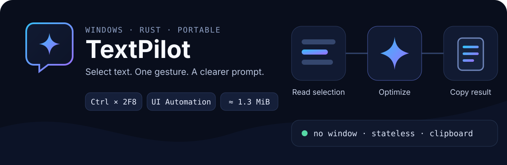

<p align="center">
  
</p>

<p align="center">
  <strong>A lightweight, windowless Windows AI text assistant.</strong><br>
  Select text, hold <kbd>Ctrl</kbd> and press <kbd>F8</kbd> twice to optimize a prompt, or <kbd>F9</kbd> twice for intelligent translation. The result is copied to the clipboard automatically.
</p>

<p align="center">
  Windows 10/11 · Rust 2021 · OpenAI-compatible API · Portable
</p>

[简体中文](./README.zh-CN.md)

## Why TextPilot

TextPilot lives in the system tray and reduces “select → process → paste” to one shortcut. It opens no chat window and keeps no conversation history. It reads the selection directly when possible, using a temporary clipboard compatibility mode only when UI Automation fails or returns no valid text.

- **Smart selection reading**: Reads text through Windows UI Automation first. If the API fails or returns no valid selected text, it temporarily copies the selection, reads it, and restores the original clipboard automatically. No manual mode switching is required; this supports some Electron editors such as AntiGravity IDE.
- **Stateless single-turn requests**: Each request sends only the current selection and active rule. Task IDs isolate successive requests.
- **Lightweight resident app**: No bundled GUI framework, async runtime, or console window. The release EXE is about 1.3 MiB; without Settings open, resident memory is about 2 MB.
- **Quiet feedback**: Reuses a compact status panel near the active input location for “Processing…” and “Copied”.
- **Compatible services**: Calls the OpenAI-compatible `/chat/completions` endpoint with configurable URL, model, and sampling parameters.
- **Built-in Settings (v0.3.0)**: An Apple/Windows 11-style settings UI rendered by the system WebView2 Runtime, with system light/dark colors, smooth text, custom dropdowns, and pill toggles. It attempts to clean the per-session settings data directory after the window closes and unifies the lower-right toast presentation.
- **Intelligent text translation (v0.4.0)**: Adds a separate translation hotkey (default `Ctrl+DoubleF9`). The AI model determines the selection language; configurable native and target languages mean native-language text translates to the target language, while any non-native foreign language translates back to the native language. Each API profile can select a separate translation model and customize the translation system prompt.
- **Configurable actions, tiered gestures, and reliability fixes (v0.5.0)**: Add, edit, or disable custom actions, each with its own hotkey, model, and system prompt. A double press runs Standard mode; a triple press can run Deep mode or route to an explicit Triple action using the same key. This release also fixes the blank status-panel deadlock, hardens atomic configuration replacement and clipboard restoration, localizes runtime errors, and keeps complete error details available from the tray menu.
- **Portable operation**: The app is one EXE and stores configuration beside it. It supports current-user startup. The settings window requires Microsoft Edge WebView2 Runtime.

## Quick start

### 1. Prepare the application

Place `TextPilot.exe` in a directory writable by a normal user and run it. On first launch it creates UTF-8 `config.json` beside the EXE.

You can also build from source:

```powershell
cargo build --release
```

The output is `target\release\TextPilot.exe`.

### 2. Configure a model

Right-click the tray icon and choose **Settings**. The window has **Models & Services**, **Actions & Rules**, and **App Behavior** pages. Each API profile can store multiple models, one per line. Every action independently binds one API profile and one model from that profile, so actions can share a profile while using different models or use entirely different profiles and models. Bindings must be valid before saving; runtime requests never silently mix another action’s profile or model. Fill in at least an API key, verify that the endpoint and selected model work, test the current action’s connection, then click **Save & Apply**.

On connection failure, the bottom of the window shows an error summary; hover it for full details. API keys are masked automatically. **Actions & Rules** manages built-in and custom action names, hotkeys, enabled state, per-action models, Standard prompts, optional Deep prompts, and translation languages.

Settings are fully validated before being written to `config.json` and applied immediately. If a hotkey conflicts or is unavailable, startup configuration or file writing fails, the app retains the old configuration and reports the specific reason at the bottom of the window.

**Models & Services** manages named profiles. Switch them with **Current Profile**, use **New** to create one, or change **Profile Name** to rename it. All changes are written and applied together through the bottom **Save & Apply** button; there is no second “Save Profile” step.

For troubleshooting, inspect `config.json` beside the EXE. Its complete structure is:

```json
{
  "active_profile": "Default Profile",
  "api_profiles": [
    {
      "name": "Default Profile",
      "api_key": "YOUR_API_KEY",
      "base_url": "https://api.openai.com/v1",
      "models": ["gpt-4o-mini", "gpt-5-mini"],
      "model": "gpt-4o-mini",
      "translation_model": "gpt-4o-mini",
      "temperature": 0.3,
      "max_tokens": 512
    }
  ],
  "hotkey": "Ctrl+DoubleF8",
  "translation_hotkey": "Ctrl+DoubleF9",
  "native_language": "Chinese",
  "target_language": "English",
  "system_prompt": "You are a prompt optimization assistant… Return only the optimized prompt.",
  "translation_prompt": "Bidirectional translation direction instruction…",
  "actions": [
    {
      "id": "optimize",
      "name": "Prompt Optimization",
      "hotkey": "Ctrl+DoubleF8",
      "profile": "Default Profile",
      "model": "gpt-4o-mini",
      "system_prompt": "You are a prompt optimization assistant… Return only the optimized prompt.",
      "triple_prompt": "Optimize the prompt in Deep mode…",
      "enabled": true
    },
    {
      "id": "translate",
      "name": "Intelligent Text Translation",
      "hotkey": "Ctrl+DoubleF9",
      "profile": "Default Profile",
      "model": "gpt-5-mini",
      "system_prompt": "Bidirectional translation direction instruction…",
      "triple_prompt": "Output the original and translation side by side…",
      "enabled": true
    }
  ],
  "result_mode": "clipboard",
  "play_sound": true,
  "auto_start": false
}
```

> `base_url` must point to the API root, such as `https://api.openai.com/v1`; the application appends `/chat/completions`. Each action binds an API profile through `profile` and a concrete model from that profile through `model`. Different actions can therefore use different models from one profile or models from entirely different profiles. New saves require valid bindings; legacy actions missing these fields migrate to the active profile and its first model when loaded. Built-in `optimize` and `translate` actions remain synchronized with their legacy top-level hotkey and prompt fields. Never commit or share a configuration file containing a real API key.

### 3. Run your first prompt optimization or translation

1. Select text in the active application. Apps with limited UI Automation support, including Chrome, automatically use clipboard compatibility mode.
2. Trigger the appropriate shortcut:
   - **Prompt optimization**: hold `<kbd>`Ctrl `</kbd>` and quickly press `<kbd>`F8 `</kbd>` twice about 0.52 seconds apart.
   - **Intelligent text translation**: hold `<kbd>`Ctrl `</kbd>` and quickly press `<kbd>`F9 `</kbd>` twice about 0.52 seconds apart. The app detects the language and translates intelligently between your native and target languages.
3. Wait for the status panel to change from “Processing…” to “Copied”.
4. Press `<kbd>`Ctrl `</kbd>` + `<kbd>`V `</kbd>` to paste the final result.

If you press the key only once, the original `Ctrl+F8` or `Ctrl+F9` is passed to the active application after a brief wait; normal shortcuts are not blocked.

## How it works

```text
Selection in the focused control
        │  Windows UI Automation; on failure, copy temporarily and restore clipboard
        ▼
Task detection (Ctrl+DoubleF8 optimize / Ctrl+DoubleF9 translate)
        │  Independent, stateless single-turn request; model selected by configuration
        ▼
OpenAI-compatible /chat/completions
        │  choices[0].message.content
        ▼
Write Unicode text to clipboard
```

Only one processing task can run at a time. A dedicated worker thread handles the network request while the Win32 main thread continues serving the tray, hotkeys, and status panel.

## Hotkeys and actions

Two action hotkeys are enabled by default, and a code-refactoring action is present but disabled by default:

```json
"hotkey": "Ctrl+DoubleF8",
"translation_hotkey": "Ctrl+DoubleF9"
```

Supported formats:

- `Ctrl+DoubleF8`: default optimization shortcut; hold Ctrl and quickly press F8 twice.
- `Ctrl+DoubleF9`: default translation shortcut; hold Ctrl and quickly press F9 twice.
- `Ctrl+TripleF8` / `Ctrl+TripleF9`: hold Ctrl and quickly press F8 or F9 three times.
- Repeated-key gestures: `Ctrl+Double...` / `Ctrl+Triple...` with `A–Z`, `0–9`, or `F1–F24`.
- Ordinary combinations: `Ctrl`, `Alt`, `Shift`, or `Win` with `A–Z`, `0–9`, or `F1–F24`.

The app checks conflicts among all enabled action hotkeys. Double and Triple gestures using the same primary key may route separately to Standard and Deep actions, but the same press count cannot be duplicated. An ordinary Ctrl combination cannot coexist with a Ctrl multi-press gesture using the same primary key. Ordinary combinations require at least one modifier; `F12` is reserved by the system and cannot be used. Every action can be enabled or disabled and given a Standard prompt. When a Double action has a Deep prompt, the third press runs Deep mode. Legacy `Ctrl+TripleA` and `Ctrl+DoubleA` settings migrate automatically to `Ctrl+DoubleF8` when loaded.

## Tray menu

- **Settings**: Open the WebView2 settings window to view, edit, validate, and apply all settings.
- **Reload Configuration**: Load a `config.json` manually edited by an external tool; this is normally unnecessary.
- **Exit**: Unregister hotkeys, remove the tray icon, and terminate the app.

The tray icon is restored automatically after Explorer restarts. A named mutex prevents duplicate launches.

## Privacy and limits

- Input reading avoids the clipboard first. When UI Automation fails, the app deep-copies safely restorable clipboard data, simulates `Ctrl+C` to read the selection, and immediately restores it. Compatibility mode no longer reuses the system OLE clipboard proxy. If the clipboard is busy or a format cannot be safely backed up, only that operation fails with a notice; the app and hotkeys keep running. Output writes only final Unicode text.
- Only the current selected text, system prompt, and request parameters are sent to the configured API service.
- API keys and named API profiles are stored as plaintext in local `config.json`; they are not written to normal runtime logs.
- Clipboard managers and Windows Clipboard History may record the temporary copy made by compatibility mode. Some games, Remote Desktop sessions, and custom controls that prohibit copying may still not expose a selection.
- The app currently supports Windows and `result_mode = "clipboard"` only; streaming output is not supported.

## Development and verification

The project uses the `stable-x86_64-pc-windows-msvc` toolchain. Before committing, run:

```powershell
cargo fmt --all -- --check
cargo check
cargo clippy --all-targets --all-features -- -D warnings
cargo test
cargo build --release
```

The release profile enables size optimization, LTO, one codegen unit, `panic = "unwind"`, and symbol stripping. Unwinding is retained so a background-task panic becomes a recoverable error instead of terminating the tray process.

## Project structure

```text
TextPilot/
├── assets/                 # App icons and Windows resources
│   └── readme/             # GitHub README visual assets
├── docs/
│   └── README.txt          # Plain-text user guide
├── src/
│   ├── api.rs              # Stateless API requests and response parsing
│   ├── config.rs           # Configuration generation, validation, and recovery
│   ├── hotkey.rs           # Ordinary combinations and multi-press gesture parsing
│   └── windows_app/        # Settings window, UI Automation, clipboard output, startup
├── build.rs                # EXE icon resource compilation
└── Cargo.toml
```
