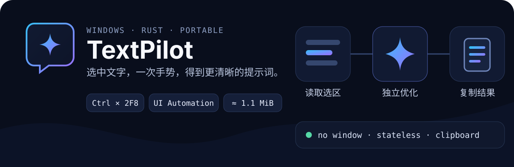

<p align="center">
  
</p>

<p align="center">
  <strong>一款轻量、无主窗口的 Windows AI 文本助手。</strong><br>
  选中文字，按住 <kbd>Ctrl</kbd> 连按两次 <kbd>F8</kbd> 优化提示词，或连按两次 <kbd>F9</kbd> 智能翻译，处理结果自动进入剪贴板。
</p>

<p align="center">
  Windows 10/11 · Rust 2021 · OpenAI-compatible API · Portable
</p>

[English](./README.md)

## 为什么使用 TextPilot

TextPilot 常驻系统托盘，把“选区 → 优化 → 粘贴”压缩成一次快捷操作。它不打开聊天窗口，也不维护会话历史；输入侧优先直接读取选区，仅在 UI Automation 报错或未返回有效文本时临时使用剪贴板兼容模式。

- **智能读取选区**：优先通过 Windows UI Automation 直接读取；接口报错或未返回有效选区文本时，自动临时复制选区，读取后恢复原剪贴板，无需手动切换模式，兼容 AntiGravity IDE 等部分 Electron 编辑器。
- **单轮无状态请求**：每次只发送本次选区和当前优化规则，使用任务 ID 隔离连续请求。
- **轻量常驻**：无打包式 GUI 框架、无异步运行时、无控制台窗口；Release EXE 约 1.3 MiB，未打开设置窗口时后台常驻内存约 ~2 MB。
- **安静反馈**：在当前输入位置附近复用同一个小型状态框，显示“优化中…”和“已复制”。
- **兼容服务**：调用 OpenAI 兼容的 `/chat/completions` 接口，可配置地址、模型和采样参数。
- **内置设置 (v0.3.0)**：基于系统 WebView2 Runtime 渲染 Apple / Win11 风格设置界面，支持跟随系统深浅配色、平滑文字、自绘下拉框和胶囊 Toggle 开关；关闭窗口后会尽力清理本次设置页的临时数据目录，并统一右下角 Toast 的视觉。
- **智能文本翻译 (v0.4.0)**：新增独立文本翻译快捷键（默认 `Ctrl+DoubleF9`）；完全依托 AI 大语言模型智能判定选区语种，支持在设置中自定义“母语”与“目标翻译语言”（若选区主语种为用户母语则译为目标语言，若是任何外文非母语则自动译回母语）；各套 API 配置均可为翻译选择独立模型，并支持修改或订制翻译系统提示词。
- **可配置动作、分级手势与可靠性修复 (v0.5.0)**：可新增、编辑、禁用自定义动作，为每个动作配置热键、模型和系统提示词；双击执行标准模式，三击可执行深度模式或路由到同键显式 Triple 动作。本版本同时修复状态框空白并导致主线程死锁的问题，强化配置原子替换与剪贴板恢复，补齐运行时错误本地化，并可从托盘菜单查看完整错误详情。
- **绿色运行**：应用本体为单个 EXE，配置存放在 EXE 同目录；支持当前用户开机自启。设置窗口需要系统已安装 Microsoft Edge WebView2 Runtime。

## 快速开始

### 1. 准备程序

将 `TextPilot.exe` 放入普通用户可写目录并运行。首次启动会在 EXE 同目录创建 UTF-8 编码的 `config.json`。

也可以从源码构建：

```powershell
cargo build --release
```

生成文件位于 `target\release\TextPilot.exe`。

### 2. 配置模型

右键托盘图标，选择 **设置**。设置窗口分为“模型与服务”“动作与规则”“应用行为”三页，可管理全部配置项。每套 API 配置可以保存多个模型（每行一个），并通过“全局主模型”与“翻译默认模型”下拉框选择回退模型。动作可单独指定模型；切换到不包含该模型的 API 配置时，普通动作回退到该配置的主模型，翻译动作回退到翻译默认模型。至少填写 API Key，并确认服务地址和所选模型可用；可测试当前动作连接，再点击 **保存并应用**。

连接失败时，窗口底部显示错误摘要，悬停可查看完整信息；配置中的 API Key 会自动隐藏。“动作与规则”页可以管理内置及自定义动作的名称、热键、启用状态、专属模型、标准提示词和可选深度提示词，并设置翻译语种。

设置会先完整校验，再统一写入 `config.json` 并立即生效。热键冲突或占用、开机自启或文件写入失败时，程序会保留原配置并在窗口底部显示具体原因。

“模型与服务”页可以管理多套命名配置。使用“当前配置”下拉框切换，点击 **新建** 创建配置，也可直接修改“配置名称”完成重命名。所有变更统一由窗口底部的 **保存并应用** 写入文件并立即生效，不再存在第二个“保存配置”步骤。

如需排障，也可以查看 EXE 同目录的 `config.json`，其完整结构如下：

```json
{
  "active_profile": "默认配置",
  "api_profiles": [
    {
      "name": "默认配置",
      "api_key": "YOUR_API_KEY",
      "base_url": "https://api.openai.com/v1",
      "models": ["gpt-4o-mini", "gpt-5-mini"],
      "model": "gpt-4o-mini",
      "translation_model": "gpt-4o-mini",
      "temperature": 0.3,
      "max_tokens": 512
    }
  ],
  "hotkey": "Ctrl+DoubleF8",
  "translation_hotkey": "Ctrl+DoubleF9",
  "native_language": "中文",
  "target_language": "英语",
  "system_prompt": "你是提示词优化助手……只返回优化后的提示词。",
  "translation_prompt": "双向翻译方向执行令……",
  "actions": [
    {
      "id": "optimize",
      "name": "提示词优化",
      "hotkey": "Ctrl+DoubleF8",
      "model": "",
      "system_prompt": "你是提示词优化助手……只返回优化后的提示词。",
      "triple_prompt": "以深度模式优化提示词……",
      "enabled": true
    },
    {
      "id": "translate",
      "name": "智能文本翻译",
      "hotkey": "Ctrl+DoubleF9",
      "model": "",
      "system_prompt": "双向翻译方向执行令……",
      "triple_prompt": "输出原文与译文对照……",
      "enabled": true
    }
  ],
  "result_mode": "clipboard",
  "play_sound": true,
  "auto_start": false
}
```

> `base_url` 应指向 API 根路径，例如 `https://api.openai.com/v1`；程序会自动追加 `/chat/completions`。`actions` 是 v0.5.0 的动作列表；`model` 留空表示使用当前 API 配置的回退模型，指定模型在当前配置中不存在时也会安全回退。为兼容旧配置，内置 `optimize` 与 `translate` 动作会和顶层 `hotkey`、`translation_hotkey`、`system_prompt`、`translation_prompt` 字段自动迁移及同步，建议通过设置页修改，避免手工维护出冲突值。v0.1.0 及更早版本的重复顶层 API 字段会在加载时自动迁移到当前配置，并在下次保存时清理。不要提交或分享包含真实 API Key 的配置文件。

### 3. 完成第一次提示词优化或文本翻译

1. 在当前应用程序中选中待处理文本；Chrome 等 UI Automation 兼容性有限的应用会自动使用剪贴板兼容模式。
2. 触发对应快捷键：
   - **提示词优化**：按住 `<kbd>`Ctrl `</kbd>`，在约 0.52 秒间隔内快速连续按两次 `<kbd>`F8 `</kbd>`。
   - **文本智能翻译**：按住 `<kbd>`Ctrl `</kbd>`，在约 0.52 秒间隔内快速连续按两次 `<kbd>`F9 `</kbd>`（自动判断语言并进行母语与目标语言之间的智能互译）。
3. 等待状态提示框从“处理中…”变为“已复制”。
4. 按 `<kbd>`Ctrl `</kbd>` + `<kbd>`V `</kbd>` 粘贴最终处理结果。

只按一次对应按键时，原本的 `Ctrl+F8` 或 `Ctrl+F9` 会在短暂等待后正常传递给当前活动应用，不会阻断普通快捷键使用。

## 工作方式

```text
当前焦点控件的选区
        │  Windows UI Automation；失败时临时复制并恢复剪贴板
        ▼
任务识别（Ctrl+DoubleF8 提示词优化 / Ctrl+DoubleF9 智能翻译）
        │  独立、无状态的单轮请求，按配置分别选调模型
        ▼
OpenAI-compatible /chat/completions
        │  choices[0].message.content
        ▼
Unicode 文本写入剪贴板
```

程序只允许一个优化任务同时运行。网络请求由唯一工作线程处理，Win32 主线程继续响应托盘、热键和状态提示。

## 热键与动作

默认启用两组动作热键，并提供一个默认禁用的代码重构动作：

```json
"hotkey": "Ctrl+DoubleF8",
"translation_hotkey": "Ctrl+DoubleF9"
```

支持以下格式：

- `Ctrl+DoubleF8`：优化快捷键默认值；按住 Ctrl，快速连续按两次 F8。
- `Ctrl+DoubleF9`：翻译快捷键默认值；按住 Ctrl，快速连续按两次 F9。
- `Ctrl+TripleF8` / `Ctrl+TripleF9`：按住 Ctrl，快速连续按三次 F8 或 F9。
- 重复按键手势：支持 `Ctrl+Double...` / `Ctrl+Triple...` 加 `A–Z`、`0–9` 或 `F1–F24`。
- 普通组合键：修饰键 `Ctrl` / `Alt` / `Shift` / `Win` 加 `A–Z`、`0–9` 或 `F1–F24`。

程序会检查所有已启用动作的快捷键冲突：同一主键的 Double 与 Triple 手势可分别路由到标准和深度动作，但相同点击次数不能重复；Ctrl 普通组合键不能与同主键的 Ctrl 多击手势共存。普通组合键必须包含至少一个修饰键；`F12` 为系统保留键，不可使用。每个动作均可启用/禁用并配置标准提示词；Double 动作配置深度提示词后，第三击执行 Deep 模式。旧配置中的 `Ctrl+TripleA` 和 `Ctrl+DoubleA` 会在加载时自动迁移为 `Ctrl+DoubleF8`。

## 托盘菜单

- **设置**：打开 WebView2 设置窗口，直接查看、修改、校验并应用全部配置项。
- **重新加载配置**：用于加载外部工具手动修改过的 `config.json`；一般操作无需使用。
- **退出**：注销热键、移除托盘图标并结束程序。

Explorer 重启后，托盘图标会自动恢复；命名互斥量用于防止重复启动。

## 隐私与边界

- 输入侧优先不访问剪贴板；UI Automation 失败时会深拷贝可安全恢复的剪贴板数据、模拟 `Ctrl+C` 读取选区并立即恢复。兼容模式不再复用系统 OLE 剪贴板代理；遇到剪贴板占用或无法安全备份的格式时只提示本次失败，程序和快捷键会继续运行。输出侧只写入最终 Unicode 文本。
- 仅向配置的 API 服务发送当前选中文字、系统提示词和请求参数。
- API Key 及命名 API 配置以明文保存在本地 `config.json`，不会写入常规运行日志。
- 剪贴板管理器或 Windows 剪贴板历史可能记录兼容模式产生的临时复制；部分游戏、远程桌面和禁止复制的自绘控件仍可能无法读取选区。
- 当前只支持 Windows 和 `result_mode = "clipboard"`；不支持流式输出。

## 开发与验证

项目使用 `stable-x86_64-pc-windows-msvc` 工具链。提交前建议依次运行：

```powershell
cargo fmt --all -- --check
cargo check
cargo clippy --all-targets --all-features -- -D warnings
cargo test
cargo build --release
```

Release 配置启用了体积优化、LTO、单 codegen unit、`panic = "unwind"` 和符号剥离；保留展开语义用于将后台任务 panic 转换为可恢复错误，避免托盘进程直接退出。

## 项目结构

```text
TextPilot/
├── assets/                 # 应用图标与 Windows 资源
│   └── readme/             # GitHub README 视觉资产
├── docs/
│   └── README.txt          # 用户纯文本使用手册
├── src/
│   ├── api.rs              # 无状态 API 请求与响应解析
│   ├── config.rs           # 配置生成、校验与恢复
│   ├── hotkey.rs           # 普通组合键和多击手势解析
│   └── windows_app/        # 设置窗口、UI Automation、剪贴板输出与自启
├── build.rs                # EXE 图标资源编译
└── Cargo.toml
```
